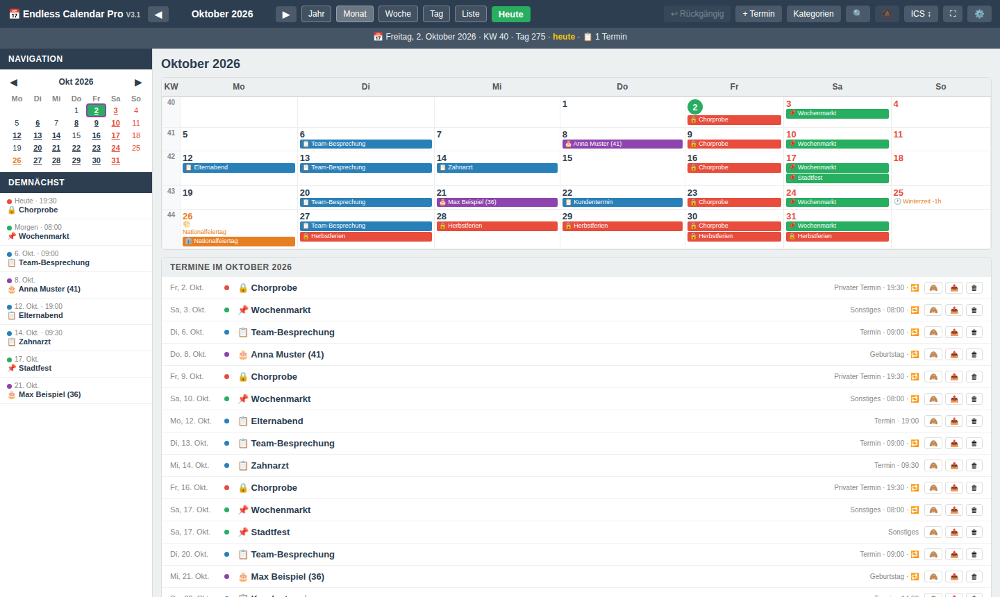
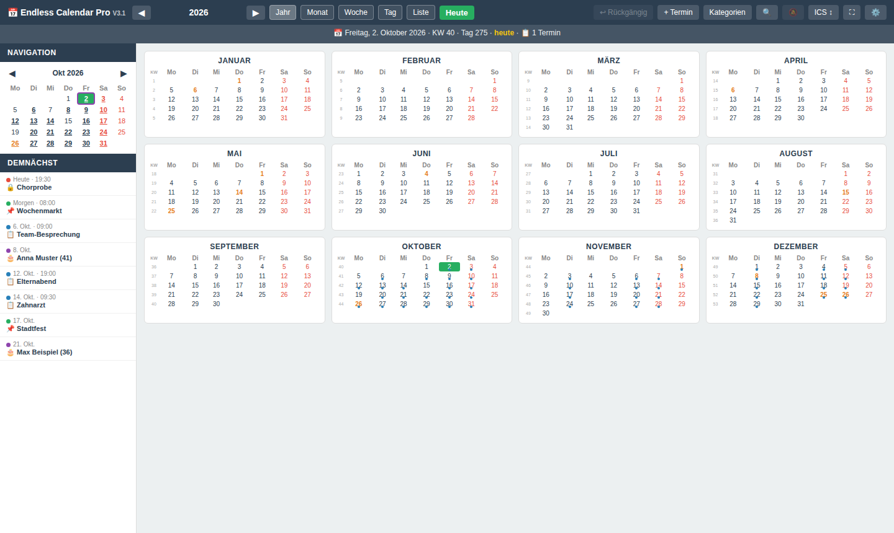

# Endless Calendar Pro

Ein vollständiger Kalender in **einer einzigen HTML-Datei**. Keine Installation, kein Konto, kein Server: Datei im Browser öffnen und loslegen – offline, unter Windows, Linux, macOS und Android. Deine Termine bleiben in deinem Browser.

🇬🇧 [English version](README.md)

## Benutzen

1. `endless_calendar_pro_V3_1.html` aus den [Releases](../../releases) (oder aus diesem Repository) herunterladen.
2. Im Browser öffnen (Firefox, Chrome, Edge …). Das ist alles.

Die Termine liegen im lokalen Speicher des Browsers für diese Datei. Sichere regelmäßig über **ICS ↕ → JSON Backup** eine Sicherungsdatei; damit ziehst du den Kalender auch in einen anderen Browser oder auf ein anderes Gerät um.

## Funktionen

- **Fünf Ansichten:** Jahr, Monat, Woche, Tag und Liste; Mini-Kalender und „Demnächst“ in der Seitenleiste; Kalenderwochen und Tag des Jahres.
- **Kategorien** mit Farbe und Emoji; je Termin eigene Farbe, Schriftfarbe und Darstellung.
- **Serientermine:** täglich bis jährlich, freie Intervalle („alle 3 Wochen“), „erster Montag im Mai“, Wochentags- und Monatsmasken („Freitag der 13.“, „nur im Sommer“), Enddatum oder Anzahl der Wiederholungen, Feiertage auslassen, Ausnahmen für einzelne Vorkommen (verschieben oder löschen).
- **Geburtstage** mit Alter und Gedenktage für verstorbene Kontakte.
- **Österreichische Feiertage** und besondere Tage, für jedes Jahr berechnet (Ostertermine, Zeitumstellung …).
- Mehrtägige Termine und Termine über Mitternacht, Drag & Drop, Kopieren und Einfügen, Konfliktwarnung.
- **Suche** über alle Termine; einzelne Termine oder ganze Serien aus- und einblenden.
- **Rückgängig** und dauerhafte Wiederherstellungspunkte vor heiklen Aktionen.
- **Import/Export:** ICS (standardkonform), JSON-Backup mit Zusammenführen oder Ersetzen, Duplikatbereinigung, Import der `birthday.dat`.
- Erinnerungen als Browser-Benachrichtigung, solange die Seite offen ist.
- Dunkelmodus mit wählbarer Akzentfarbe, Vollbild, Mobil-Layout mit Wischen.

## Funktionsweise

Alles – HTML, CSS und JavaScript – steckt in einer Datei, ohne fremde Bibliotheken und ohne Netzwerkzugriffe. Die Versionsgeschichte steht am Anfang der Datei.

Die Daten liegen im `localStorage` (Schlüssel `ecpro_v1`). Sie gehören zum Browserprofil und zum Ort, von dem die Datei geöffnet wird. Wer die Browserdaten löscht, löscht auch die Termine – deshalb Backups anlegen.

## Mitmachen

Fehlermeldungen und Ideen sind willkommen – bitte ein [Issue](../../issues) anlegen.

## Datenschutz

Die Datei sendet keine Daten. Kein Tracking, keine Statistik, keine Werbung.

## Lizenz

[MIT](LICENSE) © 2026 Heinz Bundschuh
